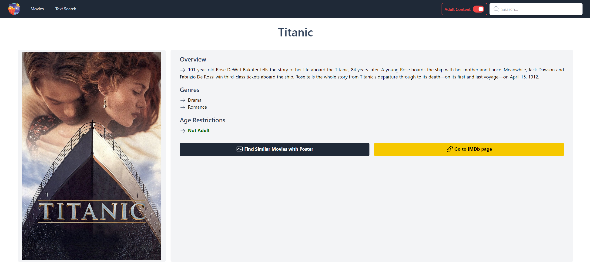

# Movie Recommendation Platform Using Deep Learning and NLP

This project is a movie recommendation platform that uses deep learning and natural language processing (NLP) techniques to suggest movies to users based on their poster preferences or keywords. The platform utilizes movie reviews and posters obtained from the IMDB and TMDB databases.

## Requirements

To run the backend of this project, you will need the following:

- Python 3.11 or higher
- TensorFlow 2.12 or higher
- Scikit-learn 1.2.2 or higher
- Keras 2.6.0 or higher
- Django 4.1.7 or higher
- djangorestframework 3.14.0 or higher

You can install the dependencies using pip:

```sh
pip install tensorflow==2.12 scikit-learn==1.2.2 keras==2.6.0 django==4.1.7 djangorestframework==3.14.0
```

To run the frontend of this project, you need to install all the dependencies listed in the package.json file.

- Node.js 16.8.0 or higher

You can install all the dependencies using npm:

```sh
npm install
```

## Usage

To run the backend of the project, follow these steps:

1. Navigate to the `movieRecommendation` directory:

```sh
cd movieRecommendation
```

2. Install the required dependencies:

```sh
pip install -r requirements.txt
```

3. Start the Django server:

```sh
python manage.py runserver
```

To run the frontend of the project, follow these steps:

1. Navigate to the `movie-recommendation-system-frontend` directory:

```sh
cd movie-recommendation-system-frontend
```

2. Install the required dependencies:

```sh
npm install
```

3. Start the React application:

```sh
npm run dev
```

or

```sh
npm run build
npm run start
```

## Screenshots

### Movies Page


### Poster Based Recommendation Results Page


### Movie Details Page



### Text Based Recommendation Results Page


### Search


